<h1 align="center">Hi 👋, I'm Pranay Prasad</h1>
<h3 align="center">Software Engineer transitioning into GenAI / LLM Engineering</h3>

  
  
  

---

### 👨‍💻 About Me

- 🔭 Currently building **multi-agent GenAI systems** — LangGraph pipelines, CrewAI crews, RAG apps
- 💼 ~2 years as a **Java backend engineer** at Infogain, now focused full-time on GenAI/LLM engineering
- 🎓 M.Tech in **Machine Learning & AI**, Lovely Professional University
- 🌱 Currently deep in **agent guardrails, evals, and production-grade agent design**
- 📍 Based in Ranchi, Jharkhand — open to relocating (Hyderabad and beyond)
- 💬 Ask me about LangChain, LangGraph, CrewAI, RAG systems, or agentic workflows
- ⚡ Fun fact: I favor going *deep* on one subject over jumping between many

---

### 🛠️ Tech Stack

  

  
  
  
  
  
  
  
   
  
  
  
  
  
  

---

### 📌 Featured Projects

  

- 🗂️ **[AstraDB Multi-Doc RAG Hub](https://github.com/pranayprasad7001/generative-ai-projects/tree/main/langchain-projects/astradb-multidoc-rag-hub)** — Multi-PDF RAG with Astra DB vector store and session-isolated indexing
- 🔎 **[Agentic Search Engine](https://github.com/pranayprasad7001/generative-ai-projects/tree/main/langchain-projects/agentic-search-engine)** — Tool-calling agent answering questions via live web search
- 🗞️ **[Agentic Daily Briefing](https://github.com/pranayprasad7001/generative-ai-projects/tree/main/crewai-projects/agentic-daily-briefing)** — CrewAI researcher/writer crew compiling a categorized daily news digest
- 🧮 **[Math & Reasoning Agent](https://github.com/pranayprasad7001/generative-ai-projects/tree/main/langchain-projects/math-reasoning-agent)** — ReAct agent switching between calculator, reasoning, and Wikipedia tools

📁 Full portfolio: **[generative-ai-projects](https://github.com/pranayprasad7001/generative-ai-projects)**

---

### 📊 GitHub Stats

  
  

  

---

  

