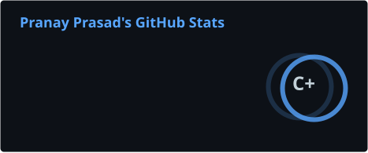
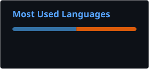

<h1 align="center">Hi 👋, I'm Pranay Prasad</h1>

<h3 align="center">AI Engineer | GenAI & LLM Systems | RAG | Agents | LangGraph</h3>

<p align="center">
  
</p>

<p align="center">
  <a href="https://linkedin.com/in/pranayprasad7">
    
  </a>
  <a href="https://github.com/pranayprasad7001/generative-ai-projects">
    
  </a>
  <a href="https://share.streamlit.io/user/pranayprasad7001">
    
  </a>
  <a href="mailto:pranayprasad7001@gmail.com">
    
  </a>
</p>

---

## 👨‍💻 About Me

I'm an **AI Engineer focused on building reliable, production-oriented Generative AI systems**.

My background is in backend software engineering, where I spent nearly **~2 years working with Java and Spring Boot** before moving deeper into Machine Learning and Generative AI.

I completed an **M.Tech in Machine Learning & AI** and now focus on building systems around:

- 🧠 Large Language Models
- 🔎 Retrieval-Augmented Generation
- 🤖 AI Agents & Tool Calling
- 🕸️ LangGraph workflows
- 🔗 MCP-based tool integration
- 🛡️ LLM guardrails and PII protection
- 💾 Semantic caching
- 🚪 LLM gateways and model routing
- 📊 LLM observability and cost tracking
- 🧪 Evaluation and reliability

I enjoy going deep into a problem — understanding **why a system fails, designing mechanisms to handle those failures, and then measuring whether the solution actually improves the system.**

---

## 🔥 What I'm Building

My current focus is moving beyond simple LLM applications toward **reliable AI systems**.

A recent example is my **Enhanced Multi-Document Search RAG**, which combines:

```text
                    User Query
                        │
                        ▼
                Security Guardrails
                        │
                        ▼
                 Query Analysis
                        │
             ┌──────────┴──────────┐
             ▼                     ▼
       Hybrid Retrieval       External Search
             │                  MCP Tools
             ▼
      Document Grading
             │
       ┌─────┴─────┐
       ▼           ▼
    Relevant     Weak
       │           │
       ▼           ▼
   Generation   Query Rewrite
       │           │
       ▼           └──────► Retrieval
Hallucination Check
       │
       ▼
Answer Relevance
       │
       ▼
Output Guardrails
       │
       ▼
     Answer
```

The system includes:

- LangGraph adaptive orchestration
- Hybrid dense + BM25 retrieval
- AstraDB
- Cohere reranking
- Query rewriting
- Retrieval grading
- Hallucination detection
- Answer relevance grading
- MCP tools
- LiteLLM gateway
- Model routing and fallback
- Redis semantic caching
- PII middleware
- Input/output guardrails
- Tool-call/result filtering
- Per-query latency and cost tracking
- LangGraph Studio
- Streamlit

👉 **[Explore the Enhanced Multi-Document Search RAG →](https://github.com/pranayprasad7001/generative-ai-projects/tree/main/langchain-projects/enhanced-multi-document-search-rag)**

---

## 🚀 Featured Projects

### 🔥 Enhanced Multi-Document Search RAG

**Adaptive, self-correcting RAG system designed around reliability, safety, and cost-aware LLM infrastructure.**

`LangGraph` `AstraDB` `BM25` `Cohere` `LiteLLM` `Redis` `MCP` `Guardrails`

👉 **[View Project](https://github.com/pranayprasad7001/generative-ai-projects/tree/main/langchain-projects/enhanced-multi-document-search-rag)**

---

### 🤖 Agentic Search Engine

Tool-calling AI agent capable of dynamically using web search tools to answer user questions.

`LangChain` `Agents` `Tool Calling` `Groq` `Streamlit`

👉 **[View Project](https://github.com/pranayprasad7001/generative-ai-projects/tree/main/langchain-projects/agentic-search-engine)**  
🚀 **[Live Demo](https://agentic-search-engine-with-exa.streamlit.app)**

---

### 📄 Conversational PDF Assistant

History-aware RAG chatbot capable of answering questions over uploaded PDFs and handling follow-up questions using conversation context.

`LangChain` `RAG` `ChromaDB` `Streamlit`

👉 **[View Project](https://github.com/pranayprasad7001/generative-ai-projects/tree/main/langchain-projects/conversational-pdf-assistant)**  
🚀 **[Live Demo](https://conversational-pdf-assistant.streamlit.app)**

---

### 🗄️ SQL Chat Assistant

Natural-language SQL agent that converts user questions into database queries while enforcing read-only database access.

`LangChain` `Agents` `SQL` `SQLAlchemy` `Streamlit`

👉 **[View Project](https://github.com/pranayprasad7001/generative-ai-projects/tree/main/langchain-projects/sql-chat-assistant)**  
🚀 **[Live Demo](https://sql-db-chat-assistant.streamlit.app)**

---

### 📰 Agentic Daily Briefing

Multi-agent CrewAI system where specialized agents research current information and produce a structured daily briefing.

`CrewAI` `Multi-Agent Systems` `Web Search`

👉 **[View Project](https://github.com/pranayprasad7001/generative-ai-projects/tree/main/crewai-projects/agentic-daily-briefing)**

---

### 🧠 Research Paper Assistant

RAG system for querying research papers using persistent vector storage and source-aware responses.

`RAG` `ChromaDB` `LangChain` `Streamlit`

👉 **[View Project](https://github.com/pranayprasad7001/generative-ai-projects/tree/main/langchain-projects/research-paper-assistant-rag)**  
🚀 **[Live Demo](https://interactive-research-paper-assistant.streamlit.app)**

---

## 🛠️ Technical Skills

### Generative AI

<p>


</p>

### LLM Providers & Models

<p>


</p>

### RAG & Retrieval

<p>


</p>

### AI Engineering

- Adaptive RAG
- Hybrid Search
- Reranking
- Query Rewriting
- Retrieval Grading
- Hallucination Detection
- Answer Relevance Evaluation
- Semantic Caching
- LLM Fallbacks
- Cost Tracking
- PII Protection
- Prompt / Output Guardrails
- Tool-call Filtering
- MCP Integration
- LangSmith Observability

### Software Engineering

<p>

</p>

- Python
- Java
- Spring Boot
- SQL
- Git / GitHub
- Docker
- REST APIs
- Backend Development

### Interfaces

<p>


</p>

---

## 🧪 Current Learning & Engineering Focus

I'm currently going deeper into the areas that make GenAI applications more reliable in real-world environments:

```text
LLMs
 │
 ├── RAG
 │    ├── Hybrid Retrieval
 │    ├── Reranking
 │    ├── Query Rewriting
 │    └── Retrieval Evaluation
 │
 ├── Agents
 │    ├── Tool Calling
 │    ├── LangGraph
 │    ├── MCP
 │    └── Multi-Agent Systems
 │
 ├── Reliability
 │    ├── Guardrails
 │    ├── Hallucination Detection
 │    ├── PII Protection
 │    └── Evaluation
 │
 └── Infrastructure
      ├── LiteLLM
      ├── Semantic Caching
      ├── Cost Tracking
      ├── Observability
      └── Deployment
```

---

## 📚 GenAI Portfolio

My complete collection of GenAI projects:

### 👉 [generative-ai-projects](https://github.com/pranayprasad7001/generative-ai-projects)

The repository currently includes projects covering:

- RAG
- Adaptive RAG
- AI Agents
- Tool Calling
- LangGraph
- CrewAI
- MCP
- SQL Agents
- Multi-Agent Systems
- Local LLMs
- Vector Databases
- Hybrid Search
- Semantic Caching
- Guardrails
- LLM Gateways
- Cost Tracking
- Streamlit / Gradio applications

---

## 📊 GitHub Stats

<p align="center">
  
  
</p>

<p align="center">
  
</p>

---

## 🎯 What I'm Looking For

I'm interested in opportunities where I can work on:

- AI Engineering
- Generative AI
- LLM Applications
- RAG Systems
- AI Agents
- Backend + AI Systems
- LLM Infrastructure
- AI Evaluation & Reliability

I'm particularly interested in teams building **real-world AI products rather than simple LLM wrappers**.

---

## 📫 Let's Connect

<p align="center">

<a href="https://linkedin.com/in/pranayprasad7">

</a>

<a href="mailto:pranayprasad7001@gmail.com">

</a>

<a href="https://github.com/pranayprasad7001/generative-ai-projects">

</a>

</p>

---

<p align="center">
  
</p>

<p align="center">
  <i>Building reliable AI systems, one failure mode at a time.</i>
</p>
